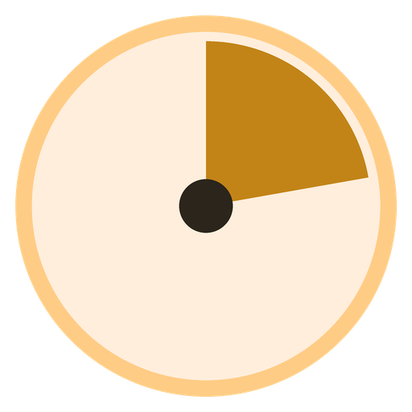

# Kairos



[](https://github.com/SKOHscripts/Kairos/actions/workflows/kmp.yml)
[](https://github.com/SKOHscripts/Kairos/releases/latest)
[](LICENSE)

**Le bon moment pour chaque tâche.** Kairos répond à une question concrète :
« qu’est-ce que je fais maintenant, et dans quel ordre, sachant qu’une réunion
de 13 h à 14 h m’empêche de traiter le sujet urgent avant 14 h 05 ? » Il range
tes tâches dans l’ordre où les faire et les place dans les trous de ta
journée. Sans compte, sans publicité, sans réseau : tes données restent sur
ton appareil.

**Android, Windows, Linux, macOS, et dans le navigateur.**
[**⬇ Télécharger**](https://skohscripts.github.io/Kairos/)

## En bref

- Il classe les tâches du jour par un score de priorité, affiché sur chacune,
  et explique ce score en un toucher.
- Il pose chaque tâche dans les trous de l’agenda, autour des réunions, avec
  une marge après chacune.
- Il protège des blocs de deep work et allège le creux de l’après-midi.
- Il chronomètre le temps réel, alerte en cas de dépassement, de chrono
  oublié ou de pause à prendre, et compare tes estimations au temps passé.

Le score de priorité vient de la méthode WSJF (« Weighted Shortest Job First ») :

```
              valeur(priorité) + criticité(échéance)
  score  =  ──────────────────────────────────────────
                   effort (points de Fibonacci)
```

- `valeur(priorité)` est exponentielle : `4^(2 − p)`, donc P0 = 16, P1 = 4, P2 = 1.
- `criticité(échéance)` monte en rampe à l’approche de l’échéance, ou de la
  date programmée si elle est plus proche. Une tâche en retard reste un palier
  à part : elle passe toujours devant, hors score.
- `effort` est la taille en points de Fibonacci (1 à 21).

Le petit et prioritaire passe donc devant le gros et lointain. Tous les poids
se règlent dans les **Réglages**.

> **Pourquoi « Kairos » ?** En grec, *καιρός* désigne le moment opportun,
> l’instant juste où agir, par opposition à *Chronos*, le temps qui défile.
> C’est le métier de l’outil : trouver le bon créneau pour chaque tâche. Nom de
> code : **14h55**, le creux post-déjeuner, l’heure la moins productive de la
> journée.

## Installer

La [page de téléchargement](https://skohscripts.github.io/Kairos/) propose le
bon fichier pour ton système. Tous les fichiers, et leurs sommes de contrôle
(`SHA256SUMS`), sont aussi dans les
[releases GitHub](https://github.com/SKOHscripts/Kairos/releases).

| Système | Fichier | Remarque |
|---|---|---|
| Android 8 ou plus récent | `Kairos-android.apk` (bientôt sur F-Droid) | Le même APK signé que sur F-Droid : on passera de l’un à l’autre sans désinstaller. |
| Windows 10 ou 11 | `Kairos-windows-x64.msi` | Installation pour l’utilisateur courant, sans droit administrateur. |
| Windows, poste verrouillé | `Kairos-windows-x64-portable.zip` | Dézipper, lancer `Kairos.exe` : rien n’est installé. Kairos propose ses raccourcis (menu Démarrer, Bureau). |
| Linux (x86-64) | `Kairos-linux-x64.deb`, ou `Kairos-linux-x64-portable.tar.gz` | Version portable : Kairos propose de s’ajouter au menu des applications, avec son icône. |
| macOS | `Kairos-macos-arm64.dmg` (Apple Silicon), `Kairos-macos-x64.dmg` (Intel) | |
| Navigateur | [Kairos en ligne](https://skohscripts.github.io/Kairos/app/) | Edge ou Chrome récents ; rien à installer. |

**Première installation.**

- **macOS** : l’application n’est pas notariée par Apple. Au premier lancement,
  clic droit sur Kairos, « Ouvrir », puis confirmer.
- **Windows** : SmartScreen peut afficher « Windows a protégé votre
  ordinateur » : « Informations complémentaires », puis « Exécuter quand même ».
- **Android** : autoriser l’installation depuis le navigateur ou le
  gestionnaire de fichiers quand Android le demande (inutile depuis F-Droid).

**Depuis Kairos 2.** Sur Android, installe Kairos 3 (APK ou F-Droid) par-dessus
Kairos 2 : il reprend ses données automatiquement au premier lancement. Sur le bureau, il
propose au premier lancement d’importer la base Kairos 2 trouvée à son
emplacement habituel ; on peut aussi l’importer plus tard (Réglages →
Données → « Importer une base Kairos 2.x »). L’ancienne base n’est jamais
modifiée. Ne sont pas repris : TimeTree et l’import GitLab, retirés de
Kairos 3.

**Mises à jour.** Sur Android, par F-Droid ou un nouvel APK. Sur
le bureau, Kairos vérifie toutes les 6 heures s’il existe une nouvelle version
et l’annonce dans un bandeau (« Télécharger » ouvre sa page) ; réglage dans
Réglages → Mises à jour. La version web est toujours la dernière.

## Fonctionnalités

### Notes (capture)

Un écran pour se décharger l’esprit sans réfléchir à la structure : un seul
champ de texte libre, aucune priorité ni échéance à choisir sur le moment
(Ctrl/Cmd+Entrée capture sans lâcher le clavier). Quand une idée est prête,
**« → Tâche »** la convertit : la première ligne devient le titre, le reste la
description, et la tâche arrive dans « À traiter ». La note est archivée,
jamais perdue. Une note peut aussi être modifiée, archivée sans suite ou
supprimée.

### Tâches

- **Capture en une ligne** : la tâche arrive dans « À traiter », le champ
  reste prêt pour la suivante.
- **Édition complète** : titre, description, priorité, points, échéance, date
  programmée, projet, durée estimée, type, récurrence, heure fixe, lien,
  sous-tâches, bloqueurs. Un seul « Enregistrer ».
- **Raccourcis clavier** (bureau et web) : `N` pour capturer, `/` pour
  chercher.
- **Sous-tâches** : avancement n/m sur la mère ; seules les feuilles sont
  planifiées.
- **Récurrence** : quotidienne, jours ouvrés, hebdomadaire, mensuelle (terminer
  une occurrence crée la suivante), et « le N du mois » (décalée au jour ouvré
  précédent si week-end ou férié).
- **« Décaler »** : atterrit toujours sur un jour ouvré.

### « À traiter »

Une tâche n’entre dans le tri qu’une fois sa **priorité** et ses **points**
posés, en un toucher sur des pastilles qui disent ce que vaut chaque choix
(**P0 Critique**, **P1 Important**, **P2 Utile** ; de « 1 trivial » à
« 21 énorme »). « Comment qualifier ? » rappelle la règle.

### Ordonnancement

- **Score** affiché sur chaque tâche ; **« Pourquoi à cette place ? »** détaille
  le calcul : ce que vaut la priorité, ce que l’échéance ajoute, l’effort qui
  divise le tout.
- **Placement** : les tâches sont posées dans les trous de la journée avec
  leur durée, une marge après chaque réunion, le débordement signalé. Une
  tâche **épinglée** à une heure n’est jamais déplacée ; un conflit est
  signalé. Une tâche **programmée** plus tard reste masquée, sauf si son
  échéance approche.
- **Points de Fibonacci** : une taille relative (1, 2, 3, 5, 8, 13, 21). Le
  guide « Comment estimer les points ? » montre, pour chaque palier, le temps
  réel médian de tes propres tâches terminées et deux exemples ; l’édition
  suggère une durée d’après ton historique.
- **Creux de l’après-midi (14h55)** : pendant une fenêtre réglable (13 h → 16 h
  par défaut), Kairos évite d’y placer les tâches complexes et y fait remonter
  les légères. Les échéances et le chemin critique priment toujours ; le score
  affiché ne change pas.
- **Jours ouvrés et fériés** : calendrier français intégré, dates
  supplémentaires dans les Réglages.

### Dépendances

« Bloqué par » : une tâche dont un bloqueur est encore à faire sort du planning
(section « Bloquées », levée automatique). Un bloqueur d’une tâche urgente
remonte dans l’ordre (chemin critique). Les cycles sont refusés.

### Créneaux et deep work

- **Créneaux occupés** (réunions, déjeuner…), ponctuels ou récurrents
  (quotidien, jours ouvrés, hebdomadaire), modifiables et supprimables.
- **Deep work** : un créneau réservé à une seule tâche, la plus urgente ; les
  autres le contournent.
- **Frise** de la journée : planifié, occupé, épinglé, deep work, conflits, et
  un rail du temps réellement chronométré.

### Temps réel et alertes

- **Chrono par tâche** (un seul à la fois), en direct sur la ligne, dans
  « Maintenant », la carte « En ce moment » et le titre de la fenêtre ; il
  survit à la fermeture de l’application et au redémarrage du téléphone.
- **Trois alertes** : dépassement de l’estimé, chrono oublié, pause
  suggérée. Un bandeau dans l’application, et une notification système :
  Android (notification permanente avec chronomètre, même application
  fermée), zone de notification du bureau, notification du navigateur.

### Vues

- **Jour** : « Maintenant », agenda ordonné, sections « À traiter »,
  « Bloquées », « Programmées plus tard », filtres, backlog, frise ; badge
  « traîne depuis N j » et bandeau de surcharge de P0. On peut regarder un
  autre jour.
- **Semaine** : sept jours (échéances, tâches faites, créneaux), temps réel de
  la semaine par type.
- **Statistiques** : débit hebdomadaire, calibration des estimations (temps
  réel médian par palier, biais), temps par type, flux, complétude. L’effectif
  est affiché ; un petit échantillon est marqué « peu fiable ».

### Données

- Tout reste sur l’appareil : aucune connexion réseau (Android n’a même pas la
  permission), aucun compte.
- **Export et import** JSON (Réglages → Données) ; une sauvegarde automatique
  précède chaque import.
- **Version web** : données enregistrées dans le navigateur, et, dans Edge ou
  Chrome, **liées à un fichier** tenu à jour à chaque modification.
- Interface en **français** et en **anglais** (langue du système).

### S’y retrouver

- Un bouton **« ? »** en haut de chaque écran : l’aide de l’écran où tu te
  trouves, l’accès à l’Accueil et à la visite guidée.
- La page **Accueil** rappelle à quoi sert Kairos et ce qu’il sait faire,
  avec un accès direct à chaque écran ; elle explique aussi comment
  travailler avec un manager ou une équipe.
- Une **visite guidée** pas à pas (six étapes), proposée au premier
  lancement et à revoir quand on veut ; une seconde visite présente l’espace
  Équipe quand il est activé.

### Gestion d'équipe (facultative)

- À activer dans **Réglages → Équipe** ; désactivée, rien ne change dans
  Kairos. Activée, un sélecteur **Perso | Équipe** apparaît en haut.
- **Membres** : quotité, heures par jour, absences ; « C’est moi » fait
  apparaître dans votre vue Jour les tâches d’équipe qui vous sont
  assignées.
- **Backlog** d’équipe trié par le même score WSJF, catégories = types de
  tâche, **assignation** et **réaffectation** (une à une ou en lot).
- **Suivi** : une ligne par membre (en cours, à faire, faites), avancement
  par pas de 10 %, signaux « en retard », « sans avancement », « ballottée »,
  limite de tâches en cours ; **historique** complet de chaque tâche.
- **Charge** : capacité de chacun (quotité, absences, jours fériés, taux de
  focus), charge et taux par membre, pour l’équipe et par catégorie, date
  de fin prévue de chaque tâche et échéances en danger ;
  **suggestion de répartition** du backlog, à accepter ligne à ligne.
- **Prévisions** par simulation (Monte Carlo) sur l’historique réel de
  l’équipe : date de fin à 50, 85 et 95 % de chances, probabilité de tenir
  chaque échéance, sujets les plus à risque, membre goulot, issue la plus
  probable ; **scénarios « Et si… ? »** (absence, renfort, réaffectation,
  tâches en plus…) comparés côte à côte, puis appliqués si on le souhaite.
- **Échanges par fichier** avec les membres qui ont Kairos, réunis dans
  l’onglet **Échanges** de l’écran Équipe : « Envoyer ses tâches… » produit un
  paquet que le membre reçoit par **Importer** (ses tâches rejoignent sa
  journée, marquées « de <manager> ») ; il renvoie son avancement
  (« Renvoyer l’avancement… »), que le manager reçoit au même endroit et
  intègre après un aperçu. Pour chaque membre, l’onglet montre la date du
  dernier paquet et du dernier rapport, et signale « En attente de son
  rapport ». Chacun garde la main sur ses champs ; rien n’est supprimé sans
  qu’on le choisisse.
- Un seul utilisateur, le manager : tout reste sur l’appareil, sans compte
  ni réseau ; les fichiers circulent comme on veut (courriel, clé USB…).

### Soutenir

- Un **cœur** dans la barre du haut (et un bouton dans « À propos et guide »)
  ouvre la [page de don](https://skohscripts.github.io/donate.github.io/) de
  l’auteur. Kairos reste gratuit et identique pour tous.

### Apparence

- **Couleur du thème** au choix (Réglages → Apparence) : le miel par défaut,
  sept autres couleurs proposées, ou une couleur libre (`#RRGGBB`). Tout le
  thème en est dérivé (Material Design 3), contrastes compris.
- Sur **Android 12 et plus**, « Couleurs du système » suit les couleurs du
  fond d’écran (Material You).

## Réglages

Chaque réglage est expliqué sous son champ ; un seul « Enregistrer », et un
champ invalide dit pourquoi.

| Section | Réglages | Défaut |
|---|---|---|
| Journée de travail | Durée par défaut, marge après un créneau, début et fin | 30 min, 5 min, 9 h – 18 h |
| Score de priorité (WSJF) | Base de valeur, horizon et poids de l’urgence, points par défaut | 4, 14 j, 8, 3 |
| Creux de l’après-midi | Activé, début, creux, fin, force | activé, 13 h – 15 h – 16 h, 1 |
| Garde-fous | Seuils « traîne » (en retard, sans date), surcharge P0 | 7 j, 14 j, 5 |
| Types de tâches | Liste des types | |
| Statistiques | Fenêtre des indicateurs | 8 semaines |
| Alertes du chrono | Chrono oublié, pause suggérée, son de secours | 180 min, 50 min, désactivé |
| Jours fériés | Calendrier français, dates supplémentaires | activé |
| Apparence | Couleur du thème (proposée, libre, ou du système sur Android 12+) | miel `#C28417` |
| Raccourci (bureau, version portable) | Créer, mettre à jour ou retirer le raccourci | proposé au lancement |
| Mises à jour (bureau) | Vérifier les nouvelles versions | activé |

## Développement

Kairos 3 est écrit en **Kotlin Multiplatform** et **Compose Multiplatform**
(dossier `kmp/`) : un seul code pour Android, le bureau (JVM) et le web
(Kotlin/Wasm). Dépendances libres uniquement, versions figées dans
`kmp/gradle/libs.versions.toml`.

```bash
cd kmp
./gradlew :core:jvmTest :data:jvmTest :ui:jvmTest :desktopApp:jvmTest   # tests
./gradlew :desktopApp:run                                                 # application de bureau
./gradlew :desktopApp:run --args=--self-test=/tmp/captures                # rendu hors écran
./gradlew :androidApp:assembleRelease                                     # APK
./gradlew :webApp:wasmJsBrowserDistribution                               # version web
```

- Architecture, modules et décisions : [`docs/spec/architecture.md`](docs/spec/architecture.md) ;
  une spécification par domaine dans [`docs/spec/`](docs/spec/README.md).
- Charte graphique (Material Design 3, thème « miel ») :
  [`docs/DESIGN_SYSTEM.md`](docs/DESIGN_SYSTEM.md).
- Versions, releases et paquets : [`docs/spec/distribution.md`](docs/spec/distribution.md) ;
  F-Droid et page de téléchargement :
  [`docs/spec/publication.md`](docs/spec/publication.md).
- Règles de contribution : [`CLAUDE.md`](CLAUDE.md).

## Licence

[MIT](LICENSE).
